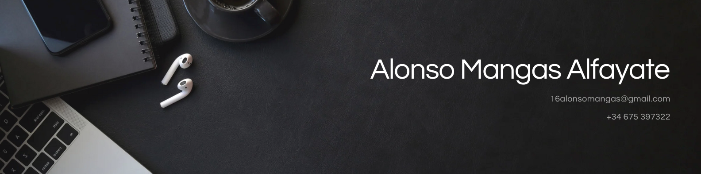

# ¡Hola a todos! 💻

<h2>✌️ Presentación</h2>
 

    Soy Alonso, un desarrollador fullstack recién graduado en <strong>Desarrollo de aplicaciones multiplataforma</strong> 🎓 
    Me apasiona la programación, especialmente el diseño y desarrollo de interfaces, y constantemente aprendo nuevas tecnologías.

    Aunque en el grado superior que he cursado he aprendido diferentes lenguajes como Java, HTML, o CSS, actualmente estoy aprendiendo lenguajes como JavaScript. Además, he aprendido diferentes lenguajes y tecnologías por mi cuenta, como PHP, o frameworks como BootStrap, Tailwindcss o NextsJs, y para poner en práctica mis conocimientos estoy desarrollando diferentes proyectos.

    En mi tiempo libre, me gusta realizar actividades como salir a caminar, ir al gimnasio, jugar al fútbol, o ver series y películas. Además, soy un apasionado del mundo del motor. Estoy muy emocionado por dar mis primeros pasos en el mercado laboral. Como desarrollador de software y aplicaciones, estoy entusiasmado por aplicar mis conocimientos y habilidades en un entorno profesional.

 
<h2>🌟 Proyectos Destacados</h2>
 

Carsell. Un proyecto FullStack desarrollado en Nextjs. Te invito a explorarlo. No te dejará indiferente.

  

  

Chat. Un proyecto FullStack desarrollado con el stack MERN. Te invito a probarlo!

  

Si deseas estar al tanto de mis proyectos, repositorios y actualizaciones sobre mi carrera, te invito a visitar mi perfil de LinkedIn. Allí comparto novedades sobre mis avances y los proyectos en los que estoy trabajando. ¡No dudes en conectar!

 
 

<h2>🔮 Habilidades</h2>
 

    Estas son algunos de los lenguajes y tecnologías que conozco actualmente.

 

  

<h2>🏙️ Localización</h2>
 

    Actualmente, resido en 📌 Ávila, mi ciudad natal. Estoy dispuesto a trabajar en diferentes ubicaciones dentro de España.

 

<h2>📧 Contacto</h2>
 

   📫 <a href="mailto:16alonsomangas@gmail.com">16alonsomangas@gmail.com</a>  
    ☎️ +34 675397322   

